## Instalar dependencias necesarias
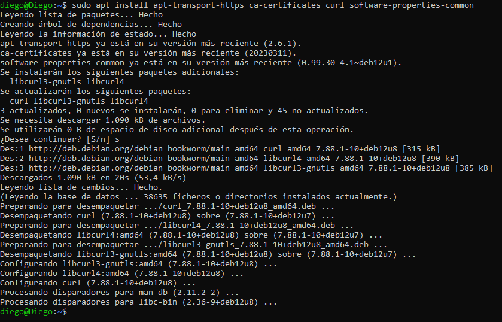

## Añadir la clave GPG oficial de Docker
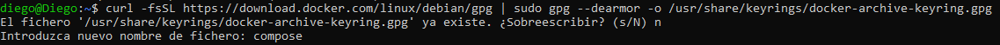

## Añadir el repsoitorio de Docker a la lista de fuentes ATP
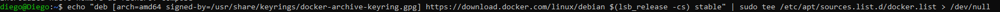

## Actualizar los paquetes e instalar Docker
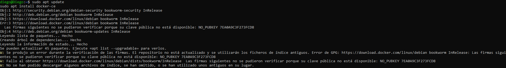

## Descargar Docker Compose
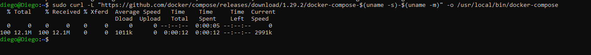

## Dar permisos de ejecucion al archivo
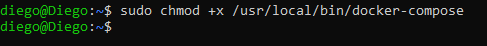

## Verificamos la instalacion de Docker Compose
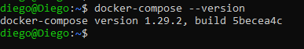

## Crear un directorio para el proyecto de MediaWiki
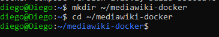

## Creo el archivo docker-compose.yml
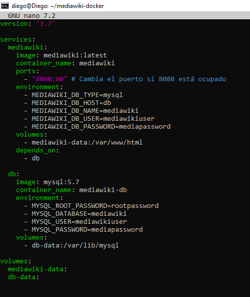

## Ejecutar Docker Compose
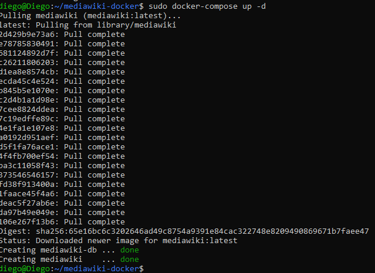

## Verificamos
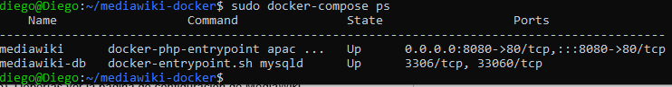

## Comprobamos
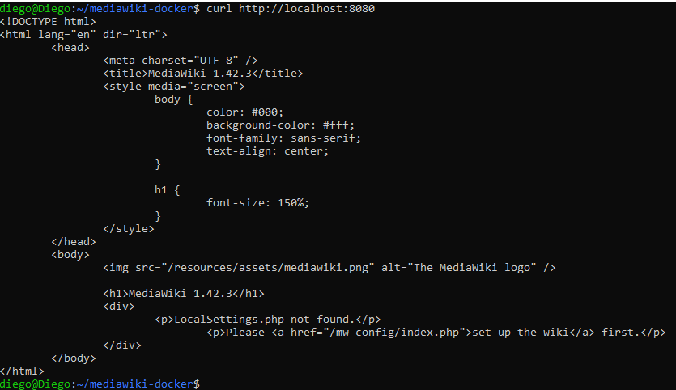

## Reiniciamos y comprobamos volumen
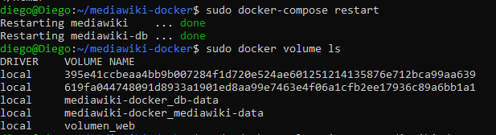

