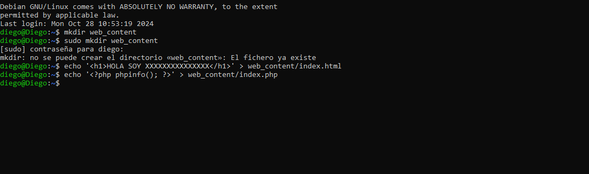
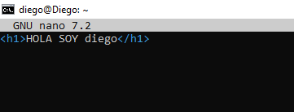
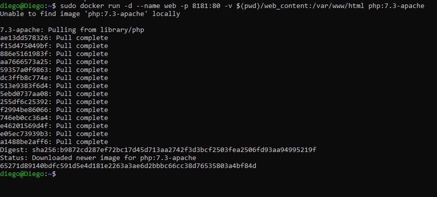
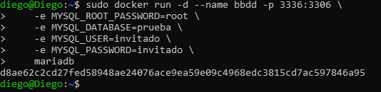
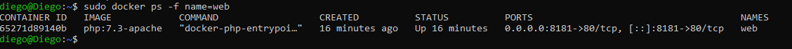
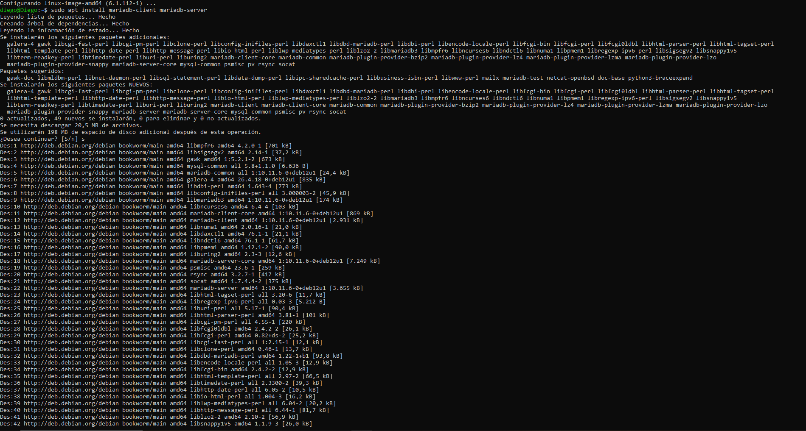
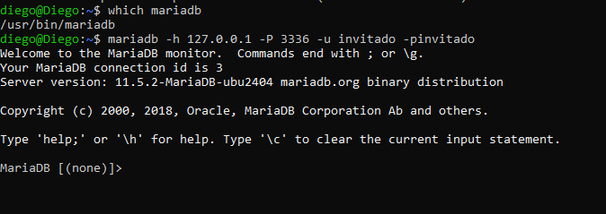

# 4.- EJECUCIÓN DE SERVICIOS DESDE CONTENEDORES

En esta tarea vas a ejecutar varios servicios web y de bases de datos sobre contenedores.

- Arranca un contenedor que ejecute una instancia de la imagen php:7.3-apache, que se llame web y que sea accesible desde tu equipo en el puerto 8181.
- Colocar en el directorio raíz del servicio web de dicho contenedor un fichero llamado index.html con el siguiente contenido: &lt;h1>HOLA SOY XXXXXXXXXXXXXXX &lt;/h1> NOTA: Deberás sustituir XXXXXXXXXXX por tu nombre y tus apellidos.

- Colocar en ese mismo directorio raíz un archivo llamado index.php con el siguiente contenido: &lt;?php phpinfo(); ?>

- Arrancar un contenedor que se llame bbdd y que ejecute una instancia de la imagen mariadb para que sea accesible desde el puerto 3336.

- Antes de arrancarlo visitar la página del contenedor en Docker Hub (https://hub.docker.com/_/mariadb) y establecer las variables de entorno necesarias para que:
    - La contraseña de root sea root.
    - Crear una base de datos automáticamente al arrancar que se llame prueba.
    - Crear el usuario invitado con la contraseña invitado.

## Paso 1: Preparar el Directorio y Archivos para el Contenedor 
Primero, creamos un directorio para alojar los archivos index.html e index.php. Seguidamente, creamos el archivo index.html con el contenido solicitado. Finalmente, creamos el archivo index.php con el contenido solicitado:

Editamos el contenido del archivo que previamente creamos para que muestre mi nombre

## Paso 2: Ejecutar el Contenedor
Ejecutamos el siguiente comando para iniciar el contenedor web con la imagen php:7.3-apache, mapeando el puerto 8181 de tu máquina local al puerto 80 del contenedor, y montando el directorio web_content como el directorio raíz del servicio web.

## Paso 3: Ejecutar el Contenedor bbdd con MariaDB
Ejecutamos el siguiente comando para iniciar el contenedor bbdd con la imagen mariadb, mapeando el puerto 3336 de tu máquina local al puerto 3306 del contenedor, y configurando las variables de entorno para establecer la contraseña de root, crear una base de datos llamada prueba, y crear un usuario invitado con contraseña invitado.

## Paso 4: Verificar los servicios
Verificamos que el contenedor bbdd está en ejecución

Instalamos mariadb

Verificamos la instalación de maridb

