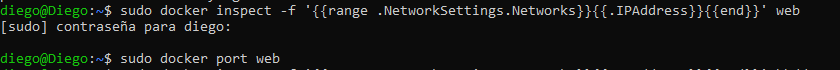
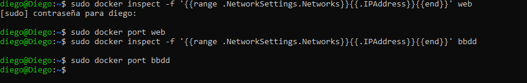

# 5.-OBTENIENDO INFORMACIÓN DE CONTENEDORES

Partiendo de los contenedores en ejecución de la tarea anterior y ejecutando la orden de docker cli adecuada obtener la siguiente información:

- Dirección IP del contenedor web.
- Redirección de puertos del contenedor web.
- Dirección IP del contenedor bbdd.
- Redirección de puertos del contenedor bbdd

## Obtener la dirección IP y la redirección de puertos del contenedor 

## Obtener la dirección IP y la redirección de puertos del contenedor bbdd
