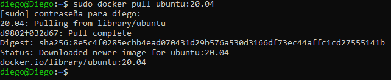
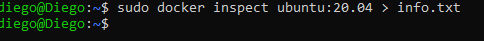
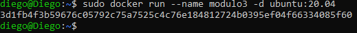
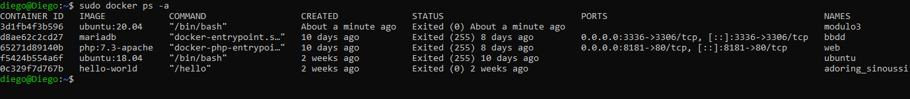
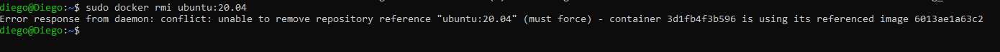
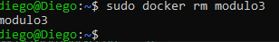
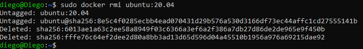

# 6.- GESTIÓN DE IMÁGENES

- Descargar la imagen Ubuntu:20.04 desde Docker Hub.
- Obtener toda la información de esa imagen y volcarla el fichero info.txt.
- Instanciar esa imagen creando un contenedor llamado modulo3. 
- Usar el comando docker adecuado para comprobar que efectivamente ese contenedor se ha creado (en ejecución o no).
- Intentar borrar la imagen Ubuntu:20.04. ¿Has podido borrar la imagen? Responde razonadamente.
- Realizar las operaciones necesarias para poder borrar la imagen. 

## Descargo la imagen Ubuntu:20.04

## Obtengo la informacion sobre la imagen y la guardo en un archivo info.txt

## Creo un contenedor llamado modulo3 a partir de la imagen Ubuntu:20.04

## Compruebo que el contenedor se ha creado

## Intento borrar la imagen Ubuntu:20.04
Al intentar borrar la imagen sale un mensaje de error porque tiene contenedores asociados. esto se debe a que Docker no permite eliminar una imagen si algún contenedor depende de ella.

## Realizo las operaciones necesarias para poder borrar la imagen
Eliminamos el contenedor

Eliminamos la imagen
