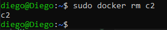

# VOLÚMENES

Iniciamos aqui el tema de la persistencia de datos:

1. Crear los siguientes volúmenes con la orden docker volume: volumen_datos y volumen_web
2. Una vez creados estos contenedores:
    - Arrancar un contenedor llamado c1 sobre la imagen php:7.4-apache que monte el volumen_web en la ruta ***/var/www/html***
    - Arrancar un contenedor llamado c2 sobre la imagen mariadb que monte el volumen_datos en la ruta ***/var/lib/mysql*** y cuya contraseña de root sea admin.
3. Parar y borrar el contenedor c2 y tras ello borrar el volumen volumen_datos.

## Creo los volumenes volumen_datos y volumen_web

## Arranco los contenedores c1 y c2 con los volumenes

### Creo y ejecuto el contenedor c1 usando la imagen php:7.4-apache

### Creo y ejecuto el contenedor c2 usando la imagen mariadb

## Paro y elimino el contenedor c2 y elimino el volumen volumen_datos

### Paro el contenedor c2

### Elimino el contenedor c2

### Elimino el volumen volumen_datos
