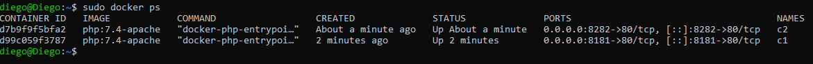

# BIND MOUNTS

Seguimos con el tema de la persistencia de datos:

1. Crea una carpeta llamada saludo y dentro de ella crea un fichero llamado index.html con el siguiente contenido:
&lt;h1>HOLA SOY XXXXXX&lt;/h1>. Deberás sustituir ese XXXXX por tu nombre.
2. Una vez hecho esto arrancar dos contenedores basados en la imagen php:7.4-apache que hagan un **bind mount** de la carpeta saludo en la carpeta /var/www/html del contenedor.
3. Uno de ellos deberá redireccionar su puerto 80 al 8181 y el otro al 8282. Y su nombres serán c1 y c2.

## Creo una carpeta saludo y

## Descargo la imagen php:7.4-apache

## Arranco los contenedores c1 y c2 con bind mounts y redireccionnamiento de puertos

### Creo y ejecuto el contenedor c1

### Creo y ejecuto el contenedor c2

## Verifico que los contenedores están en funcionamiento
