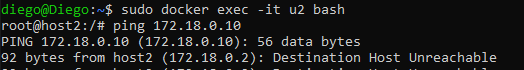

# REDES

En esta actividad vamos a crear dos redes de tipo BRIDGE con los siguientes datos:

## Red1

- Nombre: red1
- Dirección de red: 172.28.0.0
- Máscara de red: 255.255.0.0
- Gateway: 172.28.0.1

## Red2

- Nombre: red2
- El resto de los datos será proporcionados automáticamente por Docker.

Ahora, deberemos realizar los siguiente pasos:

- Poner en ejecución un contenedor de la imagen ubuntu:20.04 que tenga como hostname host1, como IP 172.28.0.10 y que esté conectado a la red1. Lo llamaremos u1.
- Entrar en ese contenedor e instalar la aplicación ping (apt update && apt install inetutils-ping).
- Poner en ejecución un contenedor de la imagen ubuntu:20.04 que tenga como hostname host2 y que esté conectado a la red2. En este caso será docker el que le de una IP correspondiente a esa red. Lo llamaremos u2.
- Entrar en ese contenedor e instalar la aplicación ping (apt update && apt install inetutils-ping).
- Ver que ambos equipos host1 y host2 se ven mutuamente

# RESULTADO

## Creo las redes

### Red 1

### Red 2

## Creo y configuro el contenedor u1

## Entro al contenedor u1 e instalo la aplicacion ping

## Creo y configuro el contenedor u2

## Entro al contenedor u2 e instalo la aplicacion ping

## Hago ping a u2 desde contenedor u1

## Hago ping a u1 desde contenedor u2
